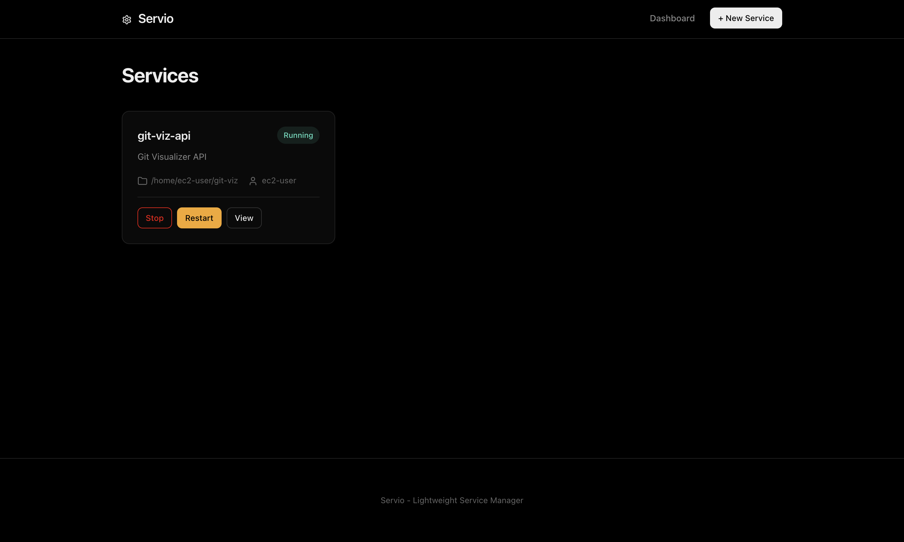

# Servio - Self-Hosted Systemd Service Manager

Servio is a lightweight, self-hosted web UI for managing systemd services on your Linux servers. It allows you to deploy, monitor, and manage services on your own infrastructure without reliance on any centralized cloud provider.


<!-- To display a screenshot, create the 'assets/screenshots' directory and save your image as 'dashboard.png' -->


## Features

- **Web Dashboard**: View all your managed services in one place.
- **Easy Service Creation**: Create new systemd services via a simple form.
- **Git Integration**: Automatically clone and deploy code from Git repositories.
- **Process Management**: Start, stop, restart, and uninstall services with a click.
- **Live Logs**: Stream logs in real-time or copy them for debugging.
- **Environment Management**: Securely configure environment variables for your applications.
- **Security**: Basic Authentication to protect your dashboard.

## Installation

### Prerequisites
- Linux server with `systemd` (e.g., Ubuntu, Debian, CentOS, Amazon Linux).
- Go (for building from source).
- `git` and `node` (optional, if your services rely on them).

### Build from Source

1.  Clone the repository:
    ```bash
    git clone https://github.com/vaishnavghenge/servio.git
    cd servio
    ```

2.  Build the binary:
    ```bash
    go build -o servio cmd/server/main.go
    ```

## Usage

### 1. Configuration

Create a `.env` file in the project root:

```ini
PORT=8080
AUTH_USER=admin
AUTH_PASS=your_secure_password
```

### 2. Running Servio

Run the server (requires root/sudo to manage systemd):

```bash
sudo ./servio
```

Visit `http://localhost:8080` in your browser.

### 3. Creating a Service

1.  Click **+ New Service**.
2.  **Service Name**: Unique name for systemd (e.g., `my-api`).
3.  **Command**: The full command to run your app (e.g., `/usr/bin/node /app/server.js`).
4.  **Working Directory**: Where the command should run (e.g., `/app`).
5.  **Git URL** (Optional): If provided, Servio will clone this repo into the Working Directory before starting.
6.  **Environment Variables**: Key=Value pairs (e.g., `NODE_ENV=production`).
7.  **Auto-restart**: Check this to have systemd restart the service on failure.

### 4. Viewing Logs

Click on any project in the dashboard to view its details.
- **Stream Live**: Watch logs flow in real-time.
- **Copy**: Copy the extensive log history to your clipboard.

## Development

To run locally on macOS (Note: Systemd features will be mocked or unavailable):

```bash
go run cmd/server/main.go
```

## License

MIT
